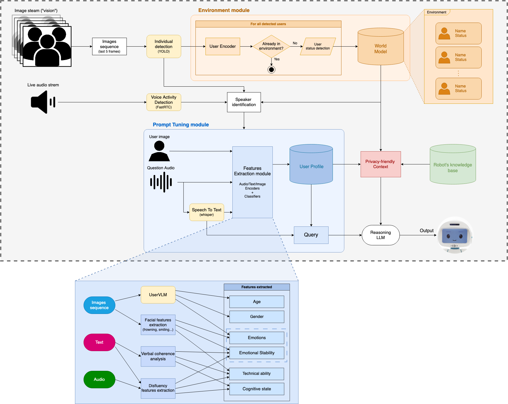

# Context-aware conversation

A simple interface to chat with a virtual assistant with a visual memory of users.  



## Installation
  
1. Clone the repository
```bash
git clone git@github.com:MalecotJeanne/Context-aware_Conversation.git
cd Context-aware_Conversation
```
2. Install dependecies
```bash
pip install -r requirements.txt
```
## Configuration
### Environment variables:
You will need an *OpenAI API key* and a *HuggingFace token* :
```bash
touch .env
echo "API_KEY=your_api_key_here" >> .env
echo "SECRET_KEY=your_secret_key_here" >> .env
```
## Execution
To run the conversation app :
```bash
uvicorn app:app --reload
```

> [!WARNING]  
> You have to choose a user image before starting interracting with the system

## Database management

Some python scripts are available in the folder `scripts` to perform basic operations on the user database (`users.db`)

### Usage in command line:

- Forget the profile of an user

```bash
python scripts/forget_profile.py -u [user_id]   
```

>The features will be erased, but the facial encoding for the user will remain
- Erase an user from the database

```bash
python scripts/remove_user.py -u [user_id]   
```

>All the information about the user will be erased (facial encoding and user profile)
- Clear the database

```bash
python scripts/clean_db.py
```

>Every user and its associated informations will be deleted.
