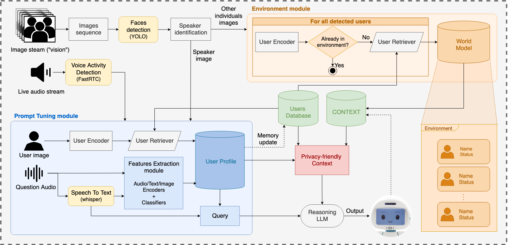
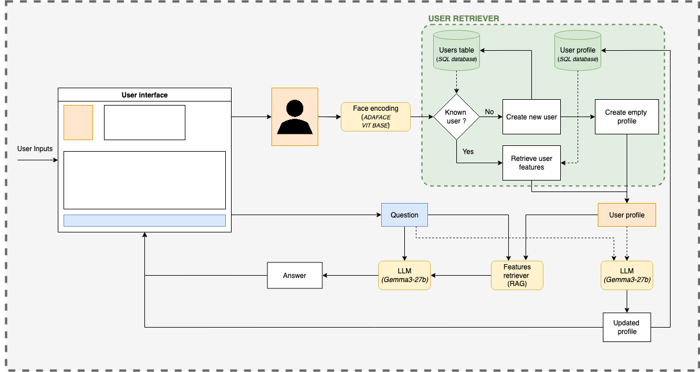
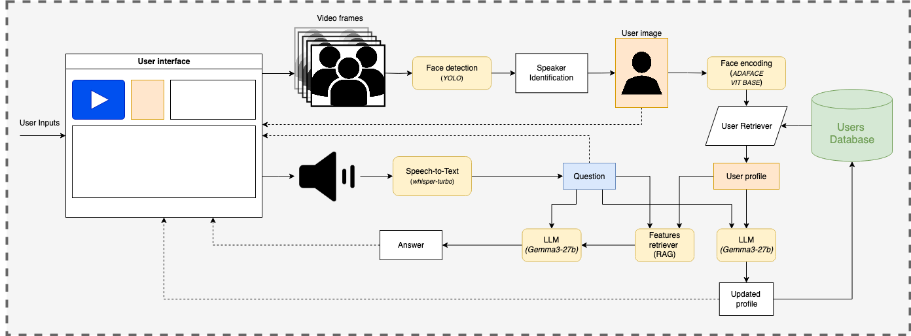

# Context-aware conversation

A framework for context-aware, multi-turn conversations with robots.  
Its goal is to enable robots to dynamically adapt to individuals and groups while respecting ethical and social constraints.



### Main features

- **Perception Module:** Interprets video input by extracting spoken questions and identifying the active speaker.
- **User Modeling Module:** Retrieves and maintains user-specific profiles and long-term memory.
- **World Modeling Module:** Maintains short-term conversational sessions and retrieves relevant memories linked to the user profiles present in the environment.
- **Generation Module:** Generates responses conditioned on both the user profile and associated memory, ensuring contextually appropriate and personalized outputs.

> [!NOTE]  
> This is a working version, only a subset of features is implemented

### Work interfaces

The framework provides several web applications that simulate different aspects of interaction between users and the assistant.  
These interfaces are useful both for testing and for developing new features.

- [**Chatbox App**](#chatbox-app) (Text-based): 
  - Users interact with the system through a text chatbox.
  - Each message is linked to a user, selected by uploading/choosing a picture.
  - Users are stored in a database that can be modified directly through the app.
  - Context and session management are supported (start new sessions, reset database).
    
- [**Video Interaction App**](#video-interaction-app) (Speaker-based):
  - Interaction is driven by video input rather than text.
  - The system identifies the active speaker in the video (assumed to contain one interaction).
  - The spoken question is transcribed, and both the transcription and system response are shown in a chatbox-like interface.
  - The same database, context, and session management tools as in the text app are available.
    
## Installation
  
1. Clone the repository
```bash
git clone git@github.com:MalecotJeanne/Context-aware_Conversation.git
cd Context-aware_Conversation
```
2. Create and activate a virtual environment (recommended: **Python 3.12**)
   
- **On Linux/macOS:**  
  ```bash
  python3.12 -m venv venv
  source venv/bin/activate
  ```
- **On Windows:**  
  ```bash
  python3.12 -m venv venv
  venv\Scripts\activate
  ```
  
3. Install dependencies
```bash
pip install -r requirements.txt
```
## Configuration

Before running the code, a few adjustments are required to ensure everything works smoothly.
You’ll need to:
- Set up the necessary [environment variables](#environment-variables).
- Choose the appropriate settings to tailor the pipeline to your objectives.

### Settings

Some variables can be adjusted in the [settings file](./config/settings.py). These parameters control aspects of the model’s behavior—for example, the tolerance for people recognition or the size of the history remembered by the system.  

⚠️ Changes should be made with care, as improper adjustments may degrade the system’s performance.

A [config file](./config/config.yaml) in **YAML** format is also available. It allows you to define key aspects of the system’s behavior, such as:
- The **LLMs** to be used.
- Important settings for **memory management** (e.g., open vs. closed vocabulary, definitions of features of interest in your scenario).

### Models

Most of the models used in the pipeline are defined in the [config directory](./config/models.py).  
You are free to experiment with other models, but if their source differs from the suggested ones, make sure their behavior is compatible—or adjust the code accordingly.
The [__init__.py](./config/__init__.py) file already includes utilities to switch easily between face embedding models. If you add new models, you may need to extend this file or create similar helper functions for the other model types.

>[!IMPORTANT]
>The LLMs used for generating answers and updating memory are defined in a config file.
>This implementation supports only the **OpenAI Client**, with two options:
>- **OpenAI model** → requires a valid *OpenAI API key*.
>- [**Ollama model**](#using-ollama) → ensure the model has been pulled to your local device.

### Environment variables

You will need a *Hugging Face token* and, optionally, an *OpenAI API key*.
If you don’t already have them set up, create a .env file in the root folder of your project and add the credentials there.

```bash
touch .env
```

Then, add the appropriate keys like this:
- **HuggingFace Token**
```bash
echo "HF_TOKEN=your_secret_token_here" >> .env
```
- **OpenAI API key**
```bash
echo "OPENAI_API_KEY=your_api_key_here" >> .env
```

### Using OpenAI models

To use an OpenAI model, simply specify its name in the config file.  
You can check which models are available for your account using either the command line or Python:

- **Command line:**
```bash
curl https://api.openai.com/v1/models \
  -H "Authorization: Bearer $OPENAI_API_KEY"
```

- **Python:**
```python
from openai import OpenAI
client = OpenAI(api_key=OPENAI_API_KEY)

  client.models.list()
```
> [!WARNING]
> If you use a model that is not on the approved list, the system will **default to using an Ollama model**.

### Using Ollama 

**Ollama** allows you to run LLMs locally without relying on the OpenAI models. To use **Ollama** with this project, follow these steps:

#### **1. Install Ollama**
  - **On macOS:**  
    Download and install from the official site: https://ollama.com/download  
    **or**  
    Use Homebrew:  
    ```bash
    brew install ollama
    ```
  - **On Linux:**
    ```bash
    curl -fsSL https://ollama.com/install.sh | sh
    ```
  - **On Windows:**  
    Download the installer from the [Ollama website](https://ollama.com/download)

#### **2. Run the Ollama server**

Once installed, start the **Ollama** background service:
```bash
ollama serve
```
This runs the local server that the client uses to interact with models.  
On most systems, the service may start automatically—you can check with:
```bash
ps aux | grep ollama
```

#### **3. Pull a model**

Before using a model, you need to pull it to your device. For example, to pull **LLaMA 3**:
```bash
ollama pull llama3
```
You can show the model already downloaded on your device with:
```bash
ollama list
```

> [!TIP]
> Test your model quickly by running:
> ```bash
> ollama run [model_name]
> ```

Check the full list of models in the [Ollama model library](https://ollama.com/search)!

## Execution

To run either app, you must be in the root directory.  
Note that both interfaces share the same configuration files and modules, but use separate databases.

> [!TIP]
> If the **CSS** of the application doesn’t load correctly, try performing a hard refresh: **Ctrl+Shift+R** (Windows/Linux) or **Cmd+Shift+R** (Mac).

### Chatbox App

To run the chatbox app:

```bash
uvicorn conv_interface.app:app --reload
```




### Video Interaction App 

To run the video interaction app:

```bash
uvicorn video_interface.app:app --reload
```




